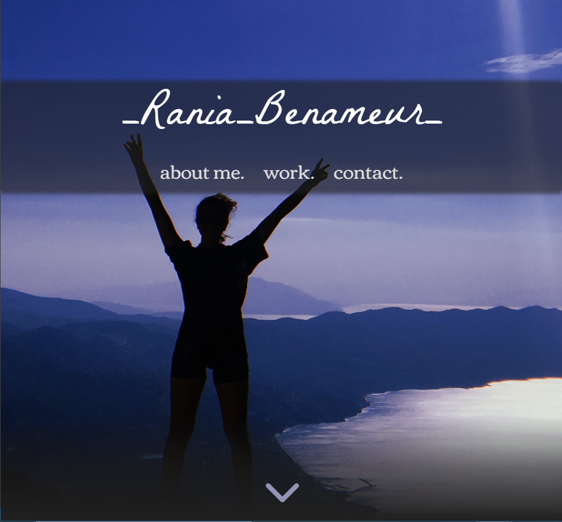
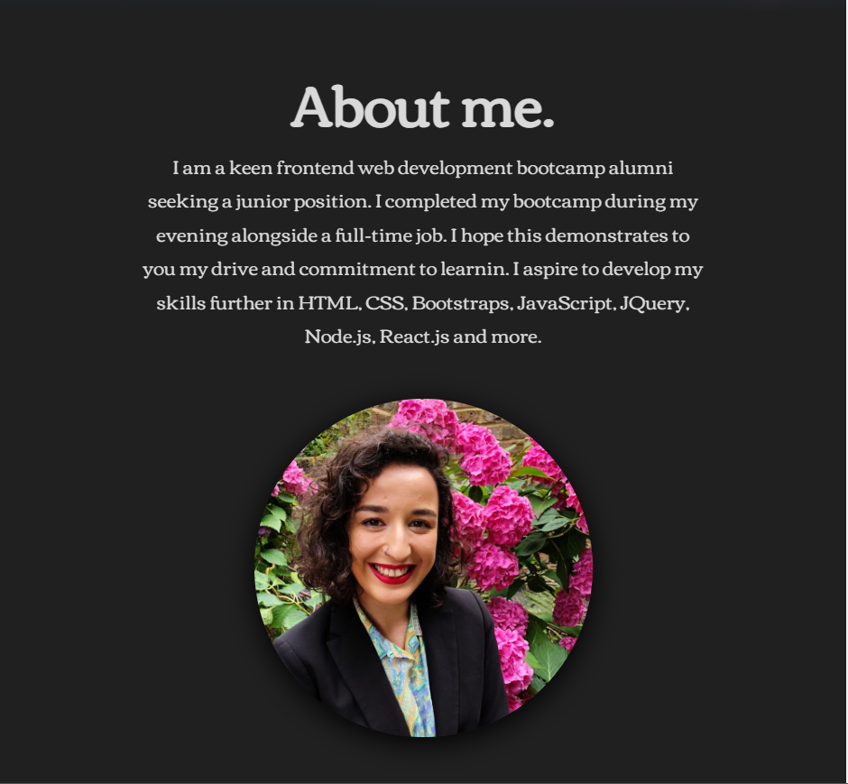
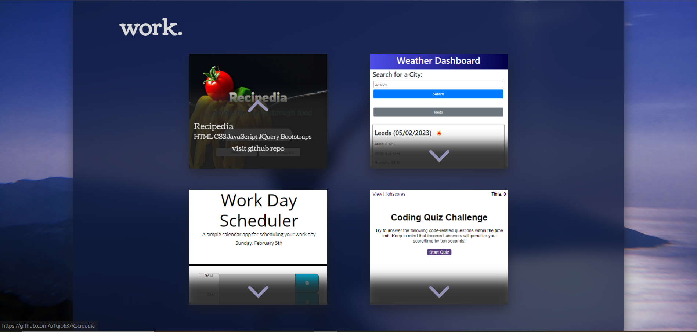
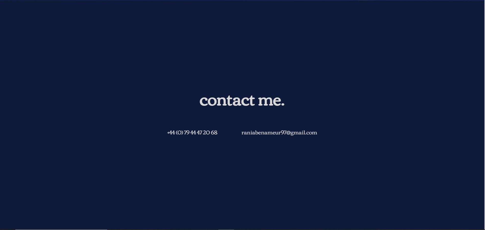
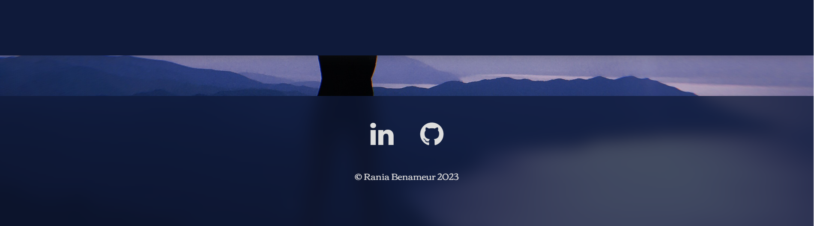

# Rania-Benameur-Portfolio

## Description

Portfolio of Rania Benameur, written in HTML and CSS to showcase skills gained from 16 week front-end web development bootcamp.

Sections include: 
* Hero and navigation
* About me 
* Work including links to github repo's for four projects
* Contact including phone number and email
* Footer including links to linkedin and github profile

## Installation

N/a

## Usage

[Access portfolio](https://rbenameur.github.io/Rania-Benameur-Portfolio "Link to deployed github page")

Click link above to navigate to Rania Benameur's portfolio. Use the nav bar to quickly navigate to relevant sections. By hovering above the project cards, some information including: project name, technologies used and a link to github repo will be visible. By clicking the link to the github repo, it will open in a new tab.

Phone number and email are available to copy (Ctrl + C for windows or CMD + C for mac) and paste (Ctrl + V for windows or CMD + V for mac) should you wish to get in touch with Rania Benameur regarding opportunites.

Links to Rania Benameur's Linkedin profile and github profile are available in the footer section.

## Credits

N/a

## License

Please refer to the LICENSE in the repo.